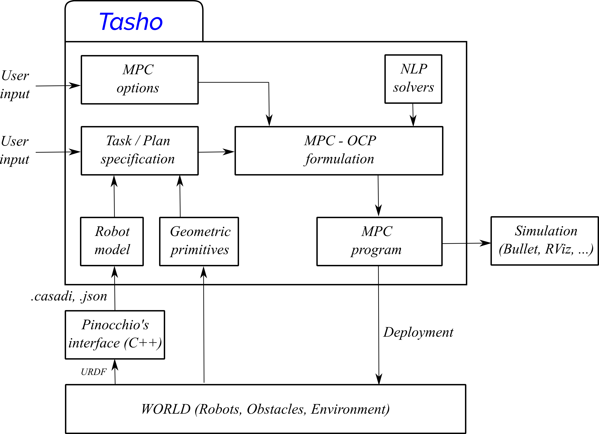

********
Examples
********

..
    .. raw:: html
        

            <iframe src="https://www.youtube.com/embed/dQw4w9WgXcQ" frameborder="0" allowfullscreen style="position: absolute; top: 0; left: 0; width: 100%; height: 100%;"></iframe>
        

Picking example
===============

Two tasks: *Move towards the object*, *Pick it and place it somewhere else*::

    from tasho import robot as rob
    from tasho import task_prototype_rockit as tp
    from tasho import input_resolution
    from tasho import discrete_plan as dp

    import casadi as cs
    from casadi import pi, cos, sin
    from rockit import MultipleShooting, Ocp
    import numpy as np

    if __name__ == '__main__':

      ...

      # -------------------------------------
      # Instantiate discrete plan
      # -------------------------------------
        plan = dp.DiscretePlan()

      # -------------------------------------
      # Setting a robot
      # -------------------------------------
        robot = rob.Robot('kinova')
        robot.set_from_json('kinova.json')
        robot.set_joint_acceleration_limits(lb = -max_joint_acc, ub = max_joint_acc)

      # -------------------------------------
      # Task 1: Move towards the object
      # -------------------------------------

        # Set task with time horizon
        tc = tp.task_context(horizon_size*t_mpc)

        # Set robot dynamics. Return states (q, q_dot), inputs (q_ddot), parameters (q0, q_dot0)
        q, q_dot, q_ddot, q0, q_dot0 = input_resolution.acceleration_resolved(tc, robot, {})

        # Define forward kinematics function
        fk_vals = robot.fk(q)[7]

        # Define goal transformation matrix
        T_goal = np.array([[0, 1, 0, 0.5], [1, 0, 0, 0], [0, 0, -1, 0.25], [0, 0, 0, 1]])

        # Add task final constraints
        final_pos = {'hard':True, 'type':'Frame', 'expression':fk_vals, 'reference':T_goal}
        final_vel = {'hard':True, 'expression':q_dot, 'reference':0}

        final_constraints = {'final_constraints':[final_pos, final_vel]}
        tc.add_task_constraint(final_constraints)

        # Add task path constraints
        vel_regularization = {'hard': False, 'expression':q_dot, 'reference':0, 'gain':1}
        acc_regularization = {'hard': False, 'expression':q_ddot, 'reference':0, 'gain':1}

        task_objective = {'path_constraints':[vel_regularization, acc_regularization]}
        tc.add_task_constraint(task_objective)

        # Set OCP solver
        tc.set_ocp_solver('ipopt', {'ipopt':{"max_iter": 1000, 'hessian_approximation':'limited-memory', 'limited_memory_max_history' : 5, 'tol':1e-3}})

        # Set discretization settings
        disc_settings = {'discretization method': 'multiple shooting', 'horizon size': horizon_size, 'order':1, 'integration':'rk'}
        tc.set_discretization_settings(disc_settings)

      # -------------------------------------
      # Task 2: Pick and place the object
      # -------------------------------------

        tc_pickup = tp.task_context(horizon_size_pickup*t_mpc)

        q_pickup, q_dot_pickup, q_ddot_pickup, q0_pickup, q_dot0_pickup = input_resolution.acceleration_resolved(tc_pickup, robot, {})

        T_goal_pickup = np.array([[1, 0, 0, 0], [0, -1, 0, -0.5], [0, 0, -1, 0.25], [0, 0, 0, 1]])

        final_pos_pickup = {'hard':True, 'type':'Frame', 'expression':fk_vals, 'reference':T_goal_pickup}
        final_vel_pickup = {'hard':True, 'expression':q_dot_pickup, 'reference':0}
        final_constraints_pickup = {'final_constraints':[final_pos_pickup, final_vel_pickup]}
        tc_pickup.add_task_constraint(final_constraints_pickup)

        vel_regularization = {'hard': False, 'expression':q_dot_pickup, 'reference':0, 'gain':1}
        acc_regularization = {'hard': False, 'expression':q_ddot_pickup, 'reference':0, 'gain':1}
        task_objective_pickup = {'path_constraints':[vel_regularization, acc_regularization]}
        tc_pickup.add_task_constraint(task_objective_pickup)

        tc_pickup.set_ocp_solver('ipopt', {'ipopt':{"max_iter": 1000, 'hessian_approximation':'limited-memory', 'limited_memory_max_history' : 5, 'tol':1e-3}})

        disc_settings_pickup = {'discretization method': 'multiple shooting', 'horizon size': horizon_size_pickup, 'order':1, 'integration':'rk'}
        tc_pickup.set_discretization_settings(disc_settings_pickup)

      # --------------------------------------------------------------------------
      # Define discrete plan
      # --------------------------------------------------------------------------
        plan.add_task(tc, "approach")
        plan.add_task(tc_pickup, "pickup")

      # --------------------------------------------------------------------------
      # Simulate plan execution
      # --------------------------------------------------------------------------

        plan.simulate_plan(simulator = "bullet", q_init = [0, -0.523598, 0, 2.51799, 0, -0.523598, -1.5708])
